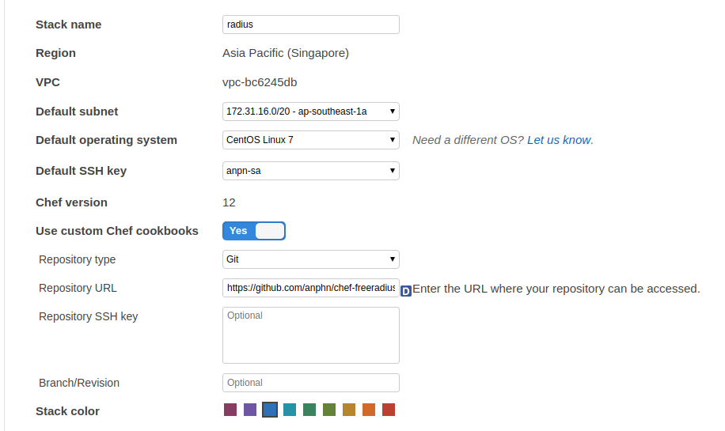
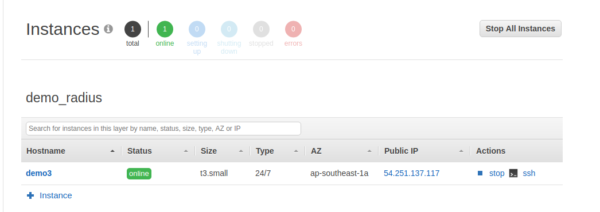
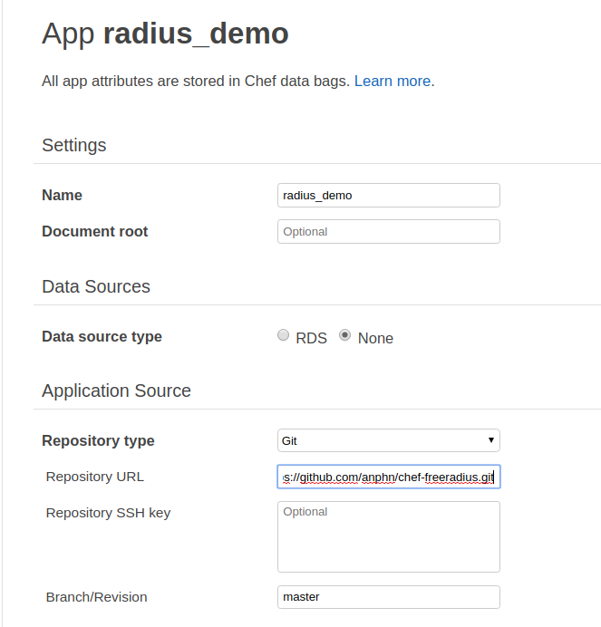
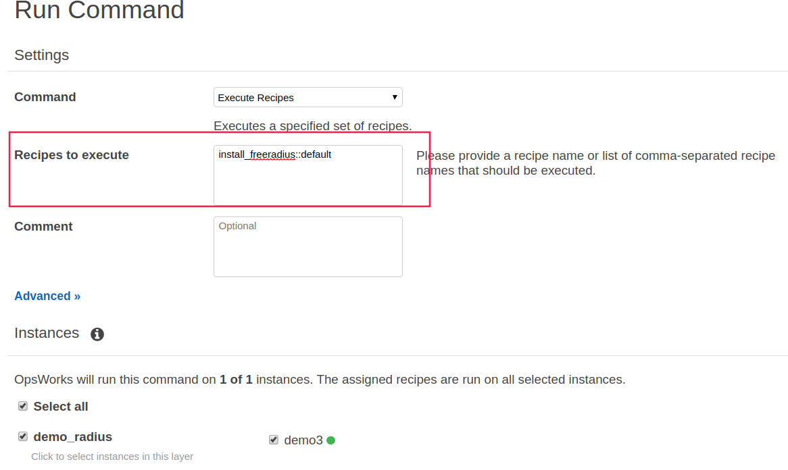
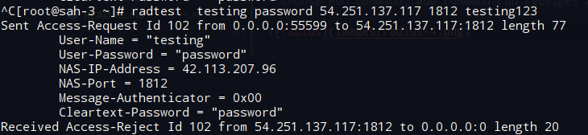

## Freeradius chef

## Requirements

* chef_version '>= 12.0'
* sql use postgresql 
* Freeradius version 3.0.4
* CentOS 7
## Usage
Enable sql support 

``` bash
default['freeradius']['enable_sql'] = true
```

Change attributes or override the following attributes in a wrapper cookbook as such
```bash 

node.override['freeradius']['enable_sql'] = true
node.override['freeradius']['db_type'] = "postgresql"
node.override['freeradius']['db_server'] = "localhost"
node.override['freeradius']['db_port'] = "5432"
node.override['freeradius']['db_name'] = "radius"
node.override['freeradius']['db_login'] = "radius"
node.override['freeradius']['db_password'] = "radius"

```

## Create postgresSQL Database

```bash
 su - postgres
 createuser radius --no-superuser --no-createdb --no-createrole -P
 createdb radius --owner=radius

```
## Testing

Use radtest

```bash
radtest testing password localhost 0 testing123
```

Where testing is the user name configured above, and password is the password for the user. These can be real user names and passwords, of course.

## Deploy use opswork

1. Create opswork stack

2. Add cook book from repo git



3. Create instances ec2 



4. Creat apps
 


5. Run Deployments 

* Choose Run Command, add command run receipes and choose instances



6. Test connect radius 

ip radius: 54.241.137.117 



